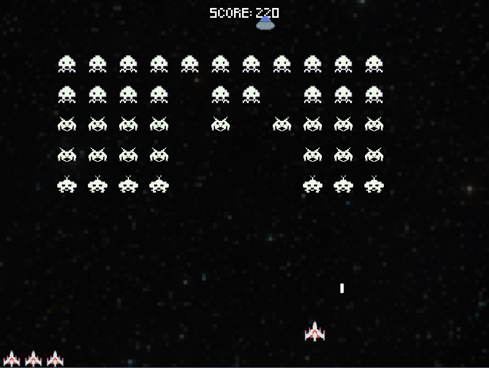
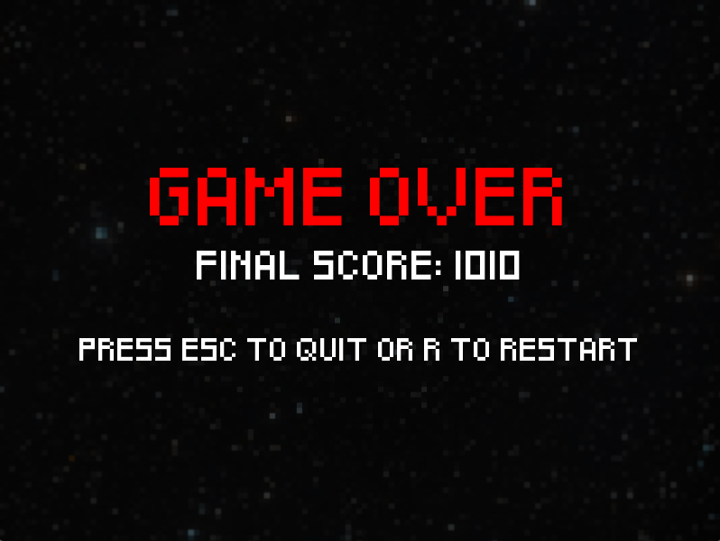

# Space Invaders (Python Arcade)

A remake of the classic Space Invaders arcade game, built in Python using the Arcade library. Shoot down alien fleets, dodge enemy bullets, and try to gain the highest score you can.




### Features
- Player-controlled ship with smooth horizontal movement
- Multiple alien types with different point values
	- **Top Alien:** 30 points
	- **Mid Alien:** 20 points
	- **Bottom Alien:** 10 points
- Aliens move as a fleet, dropping down when they hit the screen edges
- Aliens shoot bullets that can hit the player
- UFOs appear randomly for bonus points
- Score tracking and lives

### Controls
- **A:**  Move left
- **D:**  Move right
- **Space:**  Shoot
- **Escape:**  Quit game

### Project Structure

```
space-invaders-python/
├── assets/                 # Sprite images, background, and sounds
├── sprites/                # Player, Alien, UFO, and HitSplat classes
├── enums/                  # Enum for alien types
├── settings.py             # Game constants and settings
├── main.py                 # Entry point for the game
└── README.md               # This file
```


### Credits
- Original game concept: [Space Invaders](https://en.wikipedia.org/wiki/Space_Invaders)
- Python Arcade library:  https://api.arcade.academy/en/stable/
- Sprite Assets made in [Aseprite](https://www.aseprite.org/), based on original game sprites